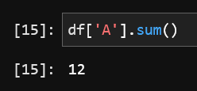

# ふわっと学ぶ　Pandas入門

---
# Pandas Dataframeとは？

>pandasは、プログラミング言語Pythonにおいて、データ解析を支援する機能を提供するライブラリである。特に、数表および時系列データを操作するためのデータ構造と演算を提供する[2]…

---

あまり難しく考えず、

## ≒pythonインタプリタから使えるエクセル

とふんわり考えておくが吉

---

# Getting started

## インストール  

~~~
pip install pandas
import pandas as pd
~~~

---

## データ形式のおさらい

Pandas Dataframeでは主に表形式のデータを扱う
時系列データとして扱う場合は、index(縦の濃い色の列)に日付データをセットする
日付データの形式はかなり柔軟に対応している

>https://pandas.pydata.org/docs/getting_started/index.html

---

## データの読み込みとエクスポート

`pd.read_*`や`df.to_*`というような構文

>https://pandas.pydata.org/docs/getting_started/index.html

---

csvからの読み込みと年月日・時刻の結合、インデックスを結合した日付データに
~~~
df　= pd.read_csv(
        "./path/to/file.csv",
        parse_dates=[['<DTYYYYMMDD>','<TIME>']]
    ).set_index('<DTYYYYMMDD>_<TIME>')
~~~

pickleファイルからの読み込み

~~~
df = pd.read_pickle('./path/to/file.pickle')
~~~

書き出し

~~~
df.to_csv('./path/to/file.csv')
~~~

---

練習用にごく簡単なデータフレームを辞書からつくる

~~~
df = pd.DataFrame(
    {
        'A': [1, 2, 3, 6], 
        'B': [10, 20, 30, 40],
        'C': [100, 200, 300, 400],
        'D': ['a', 'b', 'c', 'd']
    },
    index=['1', '2', '3','4']
  )

df
~~~
---

## 見比べてみる

ほら、同じじゃん

|Pandas|エクセル(もどき)|
|-|-|
 |

---

行の添え字を`index`と呼ぶ
pandasでは列とindexをセットで`Series`と呼ぶ

---

'A'列だけを切り出す

~~~
df['A']
~~~

---

'A'列を足す
~~~
df['A'].sum()
~~~

エクセルで書くなら

~~~
=SUM(A1:A4)
~~~

---

1行目のA,B,Cを足す

~~~
df[['A','B','C']].loc['1'].sum() 
#df.drop('D',axis=True).loc['1'].sum() # 勿論これでもOK
~~~

エクセルで書くなら
~~~
=SUM(A1:C1)
~~~

---

基本的な統計情報の取得

~~~
df.describe()
~~~

---
## Pandasの基本的な操作

|||
|-|-|
loc      |    # 行列の複数の値を取得・変更
at       |    # 行列の単一値を取得・変更
drop     |    # 列をけす
rolling  |    # 窓関数的な
sum      |    # 合計の産出
describe |    # 基本的な統計値の算出
nlargest |    # N個の最大値を取得

agg,fillna, dropna, resample...etc...

---

なかなか覚えきれるものではない…

## とてもよいサイトがありました

https://note.nkmk.me/pandas/

---

# そろそろ本気出す
（｀・ω・´）((ｷﾘｯ

---

## 応用（１）

---

## 応用（２）

---

https://forextester.jp/data/datasources
---

---

## ご清聴ありがとうございました

---
# 参考文献

https://pandas.pydata.org/docs/getting_started/index.html
https://ja.wikipedia.org/wiki/Pandas
https://note.nkmk.me/pandas/

